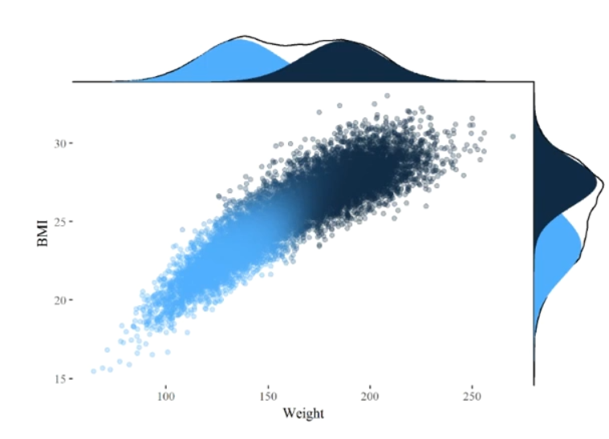

# What is Our Data?

We like to think that a lot of people are going to use this database! When it
comes to clustering, the first use case is automatic recommendations for apps
like Netflix or Spotify. Our data, [Spotify most unpopular
songs](https://www.kaggle.com/datasets/estienneggx/spotify-unpopular-songs),
details different characteristics about 10,000+ of the top most disliked songs
on Spotify. Each track is an observation with characteristics about the music:

-   Danceability (In a range from 0 to 1)

-   Energy (In a range from 0 to 1)

-   The Key (Integers mapping to pitches the 12 pitches)

-   The Mode (Major and Minor although it be crazy if this could identify the
    likability of modes like mixolydian)

-   Loudness (Decimal in floating point) \* Speechiness (In a range from 0 to 1)

-   Acousticness (In a range from 0 to 1) \* Instrumentalness (In a range from 0
    to 1)

-   Liveness (Presence of audience in a range from 0 to 1)

-   [Valence](https://en.wikipedia.org/wiki/Valence_(psychology)) (Positiveness
    from 0 to 1)

As well as more basic statistics, like:

-   Tempo (BPM floating point)

-   Duration (Integer milliseconds)

-   Explicitness (True or False)

-   Popularity (I don't know how Spotify measures this integer, but 0 to 18)

And of course, the name of the track, it's id, and the artist. The beauty of all
this data is that it can all be scraped using the Spotify API, so any work with
this data can be extended to make custom tools that interact with Spotify. If we
apply clustering to this data, we will be able to form some groups of within the
data and understand what genres might be unpopular on Spotify.

We even have genre data that we can later use to analyze whether the
unsupervised clustering is getting close to the genres we saw. The current
hypothesis is that that is very unlikely due to the complexity of music, but we
shall see!

# Exploring Our Data

First we must load it in!

```{r}
spotify <- read.csv("data/unpopular_songs.csv")
# Saving this so I don't have to convert factors later
spotify_unedited <- spotify
head(spotify)

```

I would load in the genre data, but it is so incomplete, I don't think that we
would be able to compare it to our results

Looking good, although we would want to categorize the enumerated attributes key
and mode, as well as factor explicitness.

```{r}
# Make qualitative attributes into factors
spotify$key <- as.factor(spotify$key)
spotify$mode <- as.factor(spotify$mode)
spotify$explicit <- as.factor(spotify$explicit)

# Label the factors that are just enumerators
keys <- c("C", "C#", "D", "D#", "E", "F", "F#", "G", "G#", "A", "A#", "B")
modes <- c("Major", "Minor")
levels(spotify$mode) <- as.factor(modes)
levels(spotify$key) <- as.factor(keys)
str(spotify)
```

Now our data is easier to read! Note that I labeled the data major and minor,
while we don't actually know if 0 or 1 equals major or minor. I suspect a strong
bias towards the first factor being major. In the case of our clustering results
this doesn't matter!

To get a rough overview:

```{r}
summary(spotify)
```

We can see from just the basic metrics for each attribute - Danceability and
energy's mean approaches a .5, which suggests a weak correlation to the
unpopularity of the data set.

-   The mean for tempo is 117, which approaches the common 120 bpm

-   The songs are not very acoustic, nor are they *speechy* (\~.35 and \~.14
    respectively), nor are they very instrumental. That hints they might have
    pretty heavily virtual sounds.

-   All of the decibel levels are negative, which lead me to realize that volume
    normalization plays a role. Reading [spotify's normalization
    summary](https://artists.spotify.com/en/help/article/loudness-normalization)
    helped me realize how it worked. The idea is to aim for -14 db on this
    scale, so the fact that the mean is -14 shows there might be some bad
    mastering for these songs.

Since we aren't trying to predict anything outright, just analyzing the data,
lets clean up the data and get going!

```{r}
# There are no na values!
sum(sapply(spotify, is.na))
# Now we want to remove 
```

# Clustering Algorithms

I saw an a
[quote](https://datascience.stackexchange.com/questions/22/k-means-clustering-for-mixed-numeric-and-categorical-data)
on why kMeans shouldn't use categorical data: "The fact a snake possesses
neither wheels nor legs allows us to say nothing about the relative value of
wheels and legs". There is no numerical *distancing* we can really use with
categorical data in clustering. Of course the Mode, Key, and Explicitness could
still be useful in the clustering of a musical database. If we were to take this
categorical data into account while expressing them numerically we would get a
result, and it *may* be useful because each of these values comes from a *range*
of possible values.

We can remove the factors for one data set, and convert them to integers for
another data set and check results. We also can then scale the data using the
scale function. Now the mean of each attribute is 0, and each factor is easily
comparable to all other factors.

```{r}
# DF of just numeric values
spotify_num <- spotify[sapply(spotify, is.numeric)]
# DF with categorical data, with true false converted to ints
# from 0 to 1 (Other then names and artist)
spotify_fact <- spotify_unedited
spotify_fact$explicit <- as.numeric(as.factor(spotify_fact$explicit))-1
spotify_fact <- spotify_fact[sapply(spotify_fact, is.numeric)]

# Now we scale that categorical data using the scale function
scaled_num <- as.data.frame(scale(spotify_num))
scaled_fact <- as.data.frame(scale(spotify_fact))

summary(scaled_num)
summary(scaled_fact)
```

## kMeans Clustering

Using the examples from the wine data experiment in class, we will plot the size
of the clusters in the data as well as analyze the usefulness of each number of
clusters.

```{r}
wsplot <- function(data, nc=15, seed=1234){
  wss <- (nrow(data)-1)*sum(apply(data,2,var))
  wss
  for (i in 2:nc){
    set.seed(seed)
    wss[i] <- sum(kmeans(data,centers=i)$withinss)
  }
  plot(1:nc, wss, type="b", xlab="Number of Clusters",
       ylab="Within groups sum of squares")
}
wsplot(scaled_num) 
```

If the analysis function doesn't work with a small sample size, then we know
this data probably isn't going to be too easy to cluster.

```{r}
library(NbClust)
set.seed(1234)
analyze <- function(data) {
  nc <- NbClust(data, min.nc=2, max.nc=15, method="kmeans")
  table(nc$Best.n[1,])
  barplot(table(nc$Best.n[1,]),
        xlab="Number of Clusters", ylab="Number of Criteria",
        main="Number of Clusters Chosen by 26 Criteria")
}
# Create a cluster analysis object for both data frames from a sample space of
# the original very large data set
sample_index <- sample(1:nrow(scaled_num), 1000, replace = FALSE)
sampled_num <- scaled_num[sample_index, ]
# The results of the analysis should be the same for data with factors, no need
sampled_fact <- scaled_fact[sample_index, ]
analyze(sampled_num)
analyze(sampled_fact)
```

I just sampled 1000 attributes in the data set, but it appears that 2 is a good
number of clusters for general analysis of the data when the categorical data is
not included. But if we are factoring in categorical data, 3 clusters could
yeild some good results.

Now that we know what might be the most useful number of clusters, we can
analyze them!

```{r}
fit.km1 <- kmeans(scaled_num, 2, nstart=25)
fit.km1$size
fit.km1$centers

fit.km2 <- kmeans(scaled_fact, 3, nstart=25)
fit.km2$size
fit.km2$centers
```

```{r}
aggregate(spotify_num, by=list(cluster=fit.km1$cluster), mean)
aggregate(spotify_fact, by=list(cluster=fit.km2$cluster), mean)
```

Models of this data are horrendous, so to spare you a visual assault of colors
we can skip it

Looking at this data we can draw conclusions on how the different traits of a
song can change the popularity. Generally songs are more popular if:

-   They are more lyrical (speechiness and instrumentalness)

-   They are a bit louder (threshold of -11)

-   More electronic (not acoustic) - faster in tempo

-   Happier in valence, but not necessarily lively!

-   Longer in duration

If we allow seperate further into explicit and not explicit songs, it seems
explicit songs are generally more popular in this range of unpopular songs.
Explicit songs are also perhaps a bit more danceable, or have a heavier beat.

> I want to point out the problem here, I included popularity in the model! The
> reasoning for that is, well we never would be able to accurately predict
> popularity anyway, the data is just too varied. What we could do is cluster
> data into sections to get a vague idea for *types* of unpopular songs. In this
> case, there are unpopular songs that are super unpopular seem to be a bit less
> pop-like.

## Hierarchical Clustering

Lets look at hierarchical clustering, where we segment the data into trees with
each split a division in a particular attribute. We can see above that the split
for Explicitness was rather meaningful, helping us create 3 categories of
unpopular songs. So from now on I'll use the `spotify_fact` data and
`scaled_fact` we have already made above.

We can

```{r}
d <- dist(scaled_fact)
fit.average <- hclust(d, method="average")
plot(fit.average, hang=-1, cex=.8, main="Hierarchical Clustering")
```

WOoaaaah there! Lets do this on a sample instead and cut it to create actual
categories....

```{r}
sample_index <- sample(1:nrow(scaled_num), 100, replace = FALSE)
sampled_fact <- scaled_fact[sample_index, ]
d <- dist(sampled_fact)
fit.average <- hclust(d, method="average")
plot(fit.average, hang=-1, cex=.8, main="Hierarchical Clustering")
```

> This is where I plead. I couldn't get any time off work and am running low on
> time. While I know that I could do more cutting to get better results, I can
> clearly see that the data isn't very hierarchical and can stop here without
> *not* learning anything.

## Model-Based Clustering

So, after seeing that our data isn't very hierarchical but we can still see
there is a large simple trend in what type of music might be a little less
unpopular. Model Based Clustering assumes there is some kind of generating model
underneath the data. Our data is a ranking of the least popular 10000+ songs on
amazon so theoretically there is a *trend* to the data.

From the article we were given, Mclust is a magical little function that runs

```{r}
# Model Based Clustering
library(mclust)
fit <- Mclust(scaled_num)
summary(fit) # display the best model 
```

Well this was very unexpected. It actually got much closer to interpretable
results. I guess that makes sense considering that the values in the database
were generated from some linear trend. It is just that the data is so complex (I
mean if we could predict if music was going to be popular we would be very
rich).

> Specifically, the **Mclust( )** function in the
> [mclust](http://cran.r-project.org/web/packages/mclust/index.html) package
> selects the optimal model according to BIC for EM initialized by hierarchical
> clustering for parameterized Gaussian mixture models.

EM, or expectation maximization, found that assuming the model was "VVI
(diagonal, varying volume and shape)" was the most likely to produce an accurate
model of the data. Then, it preformed a hierarchical clustering with the
starting point being clusters that divided the data, with the guidance that the
model was diagonal with varying volume and shape. In this case, 5 clusters
positioned as if the data was diagonal fit the model the best.

In an example from [this video](https://www.youtube.com/watch?v=vC7QF1-JLwI), we
can see an example of what this data does:



While this doesn't relate to our data above, it helps explain what our model
*is*. The model distribution that model-based clustering found divided the data
into clusters that fit a Gaussian distribution underneath the probability curve
of the assumed model. Our data in this case, was divided into 5 clusters that
fit under the curve.

There are too many parameters here for a visual analysis but we can try and look
at the mean values of each of the cluster to get an idea of what the model
divided them into:

```{r}
fit$parameters$mean
```

Looking at the mean of the different clusters, because the original data was
already scaled kind of arbitrarily and I couldn't get the aggregation function
to work, I am comparing the mean of the scaled values in the different functions

> The goal was learning *something* about the data

Looking at the 5 groups, I am most interested in the 2 clusters that are the max
and min of the mean range of popularity. Cluster 1, has the lowest popularity
and is characterized by:

-   Values lower than -1: energy, loudness

-   Values from -1-0: danceability, speechiness, liveness, valence, tempo,
    duration

-   Values greater than 1: Acousticness and Instrumentalness

-   Popularity: .816217187

Looks like cluster 1 is slow paced acoustic music

Cluster 4:

-   Values from -1-0: Acousticness, liveness, and duration

-   Values from 0-1: danceability, energy, loudness, speechiness,
    instrumentalness, valence, tempo

-   Popularity: 0.816217187

This tells me there is a cluster of music that is quite poppy. That is What I
would expect!

# Conclusion and Analysis

The data itself was very spread on genre with not much overlap as could be seen
from the included genre data. However, clustering was still able to reveal
trends in what kind of songs were in this lower popularity of music.

-   kMeans was a little bit too simple for this data, with the clusters not
    really able to divide the music by genre. It was quite good in small cluster
    numbers however, because it could show us how different qualities of music
    might make the music more popular. The data was very dense, so it could be
    expected that randomly assigning centroids wouldn't yield a tailored result.

-   Hierarchical data was something we fully expected not to work. It would take
    a neural network to try and get close to our perception of what a sub genre
    of music is. That is why we only really examined the large deprogram. It
    clearly separated the music, but in a way that couldn't be more meaningful
    then whats to come:

-   Model-Based clustering feels like magic. The implementation of comparing the
    likelihoods of a model fitting a given value, and dividing the clusters to
    maximize probability is very ingenious. The result was the overall diagonal
    shape being found in the data. Something that I could not have seen in the
    data. This also meant the 5 clusters found were a bit more purposefully
    placed along a range in the data. This result was very promising in helping
    an analyst discover what genres don't work that well on spotify.

The last section there really shows the potential of clustering, as while we
didn't gain too much concrete data on the model, I can easily see comparing
these results to labels during preparation for a larger prediction algorithm or
integration into a larger data set.
